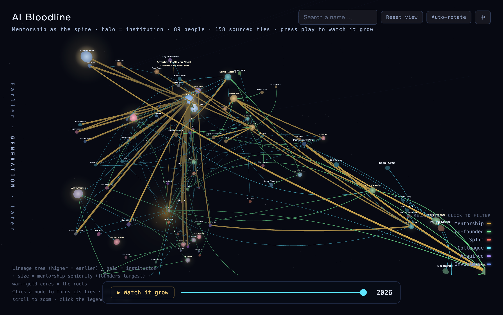

[English](README.md) | **中文**

# AI 思想血脉家谱

我想知道，今天这些 AI 大佬，到底是谁教出谁的。于是我把整个 AI 发展史连成了一张图——每条线都查得到出处。

这是一张 AI 发展史的人物关系图。每个点是一个人，每条线是他们之间真实发生过的事——师承、一起创业、同事、投资、收购、决裂。我把 AI 的整个发展历程连成了一张网。

我用 AI 跑了一套多 Agent 协作的考证流程，去验证每条关系的真实出处：必须找到一字不差的网页原文，必须带上能点开的链接，必须换个 AI 重新打开网页肉眼复核。查不到出处的，哪怕再合理也一条不画；拿不准的，全标成虚线。我能保证，图里每一条线都有据可查。如果发现写错了，欢迎随时联系我。

<p align="center">
  <a href="https://ryanyunweiyan.github.io/ai-bloodline/"></a>
</p>

<video src="https://github.com/RyanYunweiYan/ai-bloodline/raw/main/docs/media/demo.mp4" controls muted width="860"></video>

**▶ 在线体验：https://ryanyunweiyan.github.io/ai-bloodline/**（建议桌面端访问，支持拖拽环绕、滚轮缩放、点击节点查看详细关系；右上角可切换 中/EN。）

---

## 它是什么，怎么读这张图

- **点 = 人**：点越大，辈分越高——带出最多徒子徒孙的那几个祖师爷最大、最亮。点外圈光的颜色，代表他待过的厂或学术圈（Google、DeepMind、OpenAI、Anthropic……）。
- **线 = 关系**：按类型分颜色：师承（金）、一起创办公司（绿）、同事（青）、投资（蓝）、收购（紫）、决裂（红）。金色的师承线，是整张图的骨架。
- **坐标 = 脉络**：竖着看是辈分，越往上越早；横着看是同一支血脉的延展。
- **核心 = 祖师爷**：那几个暖金色的大亮核，就是整张图的源头。你会发现整张图的根其实就那么十几个人，各大厂现在的核心骨干，多半是他们的徒子徒孙。
- **时间轴与「▶ 薪火相传」**：拖动底部的轴，能看任意一年的行业格局；点播放键，关系会按发生的时间先后一条条亮起来，像火顺着血脉往下传。

---

## 一个事实：一篇论文的 8 个作者，带出了半个 LLM 工业

2017 年，Google 的八个人写了一篇《Attention Is All You Need》，提出了 Transformer——今天绝大多数大语言模型的底座。后来这八个人散了，各自去了不同的地方：

- Aidan Gomez 创办了 Cohere；
- Noam Shazeer 和 Daniel De Freitas 创办了 Character.AI（2024 年又被 Google 花了大约二十七亿美元请回去做 Gemini）；
- Ashish Vaswani 和 Niki Parmar 先后创办了 Adept 和 Essential AI；
- Llion Jones 在东京创办了 Sakana AI；
- Łukasz Kaiser 去了 OpenAI，参与做了 o1 这一代会推理的模型。

往上看，他们都出自 Google Brain 这棵老树（和 Quoc Le、Jeff Dean、Hinton 是同事）；其中 Aidan Gomez 还是 Hinton 在 Google Brain 带过的人，Hinton 本人也投了 Cohere。一篇论文的署名页，几乎把今天半个大模型行业都牵了出来。这条线，在图里被单独标了出来。

---

## 每条关系，都验证了三件事

为了把 AI 瞎编的概率降到最低，数据在画出来之前，我的 Agent 链条验证了三件事：

1. **死磕原话**：负责抓数据的 AI 上网搜，必须找到一句一字不差抄自真实网页的原文，附带网址。不准总结，不准翻译，不准自作聪明改写。
2. **交叉复核**：第二批 AI 拿着网址重新打开，不信上一步的结论，自己从头重查。只要发现证据有一丝夸大（比如把“研究员”说成“联合创始人”），直接打回去。
3. **弱关系过滤**：删掉那些纯凑数的弱联系（比如仅仅同时出现在一长串论文作者名单里），只留真正对行业走向有分量的强纽带。

我想做的是个能溯源的干净底座。图是个钩子，背后这套“怎么让 AI 别瞎编”的洗数据流程，才是我真正拿出来分享的。

---

## 自己跑起来

成品就是一个 HTML 文件，不用起服务器，浏览器直接打开就能看。

```bash
git clone https://github.com/RyanYunweiYan/ai-bloodline.git
cd ai-bloodline
node scripts/gen-bloodline.js   # 读 data/ 生成 HTML，打开 index.html 即可
```

画图用 three.js + 3d-force-graph；考证那套跑在 Claude Code 的多 AI 协作上。数据都在 data/。

---

## 它现在做不到什么

- **不是全貌**：目前只收录了 92 个人、162 条关系，以 Transformer 团队和几个核心学术源头为主，不是 AI 史的全景。
- **也会出错**：这套做法能挡住凭空捏造，但挡不住 AI 偶尔看走眼。每条关系都留了出处，如果你发现哪条连错了，欢迎开 issue 挑错，我会立刻迭代。
- **功能还早**：目前还做不到输入任意人自动生成图、查两人交集、或者自动补全。这些留到 v2。
- **手机体验一般**：优先配了桌面端的拖拽和缩放，竖屏只是“能看”，没专门优化。

接下来的打算：补核心人物 → 标注关系权重 → 开放任意人物输入查询。

---

## 关于

这是我个人做的项目，一个人利用业余时间，用 AI 一条条考证连出来的。一是好奇这些人到底谁跟谁什么关系，二是想验证「让 AI 别瞎编」这套做法到底靠不靠谱。欢迎交流，也欢迎挑错。

发现连错了，或者觉得少了哪条关键线，欢迎开 issue。如果能附带出处链接就更好了。

- GitHub：[RyanYunweiYan](https://github.com/RyanYunweiYan)

## License

本项目以 [MIT 协议](LICENSE) 开源。
